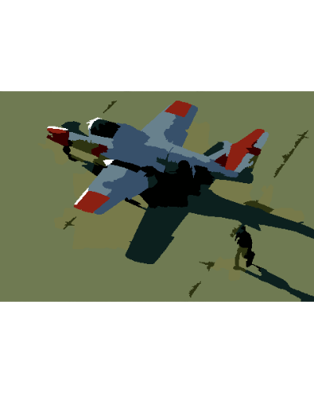

In this vignette, I'll explain the new functionality of the OpenImageR package, [SLIC and SLICO superpixels](https://www.epfl.ch/labs/ivrl/research/slic-superpixels/) (Simple Linear Iterative Clustering) and their applicability based on [an IJSR article](https://pdfs.semanticscholar.org/6533/654973054b742e725fd433265700c07b48a2.pdf). The author of the article uses superpixel (SLIC) and Clustering (Affinity Propagation) to perform image segmentation (the article was reproduced using the latest versions of the [OpenImageR](https://github.com/mlampros/OpenImageR) and [ClusterR](https://github.com/mlampros/ClusterR) packages).

<br>

### Superpixels


"Introduced by Ren and Malik in 2003, superpixels group pixels similar in color and other low-level properties. In this respect, superpixels address two problems inherent to the processing of digital images: firstly, pixels are merely a result of discretization; and secondly, the high number of pixels in large images prevents many algorithms from being computationally feasible. Ren and Malik introduce superpixels as more natural entities - grouping pixels which perceptually belong together while heavily reducing the number of primitives for subsequent algorithms." You can read more about superpixels in [this arxiv article](https://arxiv.org/pdf/1612.01601.pdf).

<br> 

The *superpixels()* function of the *OpenImageR* package is based on the open source C++ code of the [IMAGE AND VISUAL REPRESENTATION LAB IVRL](https://www.epfl.ch/labs/ivrl/research/slic-superpixels/) and allows users to receive *labels* and *output slic images*. The following code chunk illustrates how this can be done using either the "slic" or the "slico" method,

<br>

```R

library(OpenImageR)

path = system.file("tmp_images", "slic_im.png", package = "OpenImageR")

im = readImage(path)


#--------------
# "slic" method
#--------------

res_slic = superpixels(input_image = im,
                       method = "slic",
                       superpixel = 200, 
                       compactness = 20,
                       return_slic_data = TRUE,
                       return_labels = TRUE, 
                       write_slic = "", 
                       verbose = TRUE)

str(res_slic)

List of 2
 $ slic_data: num [1:360, 1:360, 1:3] 255 255 255 255 255 255 255 255 255 255 ...
 $ labels   : num [1:360, 1:360] 0 0 0 0 0 0 0 0 0 0 ...
 
 
 
#---------------
# "slico" method       [ the "slico" method does not require the "compactness" parameter ]
#---------------

res_slico = superpixels(input_image = im,
                        method = "slico",
                        superpixel = 200, 
                        return_slic_data = TRUE,
                        return_labels = TRUE, 
                        write_slic = "", 
                        verbose = TRUE)

str(res_slico)

List of 2
 $ slic_data: num [1:360, 1:360, 1:3] 255 255 255 255 255 255 255 255 255 255 ...
 $ labels   : num [1:360, 1:360] 0 0 0 0 0 0 0 0 0 0 ...

```

<br>

```R

#-----------------------------
# plot both "slic" and "slico"
#-----------------------------

par(mfrow=c(1,2), mar = c(0.2, 0.2, 0.2, 0.2))

plot_slic = OpenImageR::NormalizeObject(res_slic$slic_data)
plot_slic = grDevices::as.raster(plot_slic)
graphics::plot(plot_slic)

plot_slico = OpenImageR::NormalizeObject(res_slico$slic_data)
plot_slico = grDevices::as.raster(plot_slico)
graphics::plot(plot_slico)


```

<br>


<br>

According to the [authors of the slic method](https://www.epfl.ch/labs/ivrl/research/slic-superpixels/), "*SLIC uses the same compactness parameter (chosen by user) for all superpixels in the image. If the image is smooth in certain regions but highly textured in others, SLIC produces smooth regular-sized superpixels in the smooth regions and highly irregular superpixels in the textured regions. So, it becomes tricky choosing the right parameter for each image. SLICO does away with this problem completely. The user no longer has to set the compactness parameter or try different values of it. SLICO adaptively chooses the compactness parameter for each superpixel differently. This generates regular shaped superpixels in both textured and non textured regions alike. The improvement comes with hardly any compromise on the computational efficiency – SLICO continues to be as fast as SLIC*."

<br>

More information about the parameters of the *superpixels()* function can be found in the package documentation.

<br>

### Image segmentation

"In computer vision, image segmentation is the process of partitioning a digital image into multiple segments (sets of pixels, also known as super-pixels). The goal of segmentation is to simplify and/or change the representation of an image into something that is more meaningful and easier to analyze. Image segmentation is typically used to locate objects and boundaries (lines, curves, etc.) in images. More precisely, image segmentation is the process of assigning a label to every pixel in an image such that pixels with the same label share certain characteristics." You can read more about image segmentation in this [wikipedia article](https://en.wikipedia.org/wiki/Image_segmentation).


<br>


### Affinity Propagation


"Affinity propagation is a new algorithm that takes as input measures of similarity between pairs of data points and simultaneously considers all data points as potential exemplars. Real-valued messages are exchanged between data points until a high-quality set of exemplars and corresponding clusters gradually emerges. We have used affinity propagation to solve a variety of clustering problems and we found that it uniformly found clusters with much lower error than those found by other methods, and it did so in less than one-hundredth the amount of time. Because of its simplicity, general applicability, and performance, we believe affinity propagation will prove to be of broad value in science and engineering." The Affinity Propagation algorithm is explained in detail in the *"authors web page"* ( www.psi.toronto.edu/index.php?q=affinity%20propagation ).


<br>

### Image segmentation based on superpixels (SLIC, SLICO) and Affinity Propagation (AP)


The [author of the article](https://pdfs.semanticscholar.org/6533/654973054b742e725fd433265700c07b48a2.pdf), that I mentioned earlier, uses a method named **SLICAP** (SLIC + AP) to perform image segmentation. The methodology is the following:

* First, the SLICAP technique uses the SLIC superpixel algorithm to form an over-segmentation of an image
* Then, a similarity is constructed based on the features of superpixels
* Finally, the AP algorithm clusters these superpixels with the similarities obtained

<br>

The advantages of this method compared to other methods are the following:

* similarities are not computed based on all data (image), but on the resulted superpixels (reduction of the computational burden)
* the user does not have to specify the number of clusters (AP algorithm) as is the case with other clustering methods such as Kmeans

<br>

The author of the article utilizes,

* the [CIELAB colour space](https://en.wikipedia.org/wiki/CIELAB_color_space) which is designed to be perceptually uniform with respect to human color vision
* the *negative Euclidean distance* (although the author uses 3 different similarity measures (page 1526), I'll use the first one in my code because it gives better results)
* *weights for the 3 colour channels* (wL, wA, wB) because they keep balance so as to be consistent with human perception
* a *colorradius* to adjust the number of clusters. If its value is low, the number of targets would increase, which leads to more detailed segmentation results
* the [Berkeley Segmentation Database (BSD)](https://www2.eecs.berkeley.edu/Research/Projects/CS/vision/grouping/resources.html) (it can be downloaded also from my [Github repository](https://github.com/mlampros/DataSets))

<br>

I bundled the code in an R package, [SuperpixelImageSegmentation](https://github.com/mlampros/SuperpixelImageSegmentation), which can be downloaded from Github (consult the README.md file of the package for more information). The following code snippet first reads the input image and then performs image segmentation based on SLIC superpixels and AP clustering,

<br>

```R

library(SuperpixelImageSegmentation)

path = system.file("images", "BSR_bsds500_image.jpg", package = "SuperpixelImageSegmentation")

im = OpenImageR::readImage(path)

```

<br>


```R

init = Image_Segmentation$new()

spx = init$spixel_segmentation(input_image = im, 
                               superpixel = 600, 
                               AP_data = TRUE,
                               use_median = TRUE, 
                               sim_wL = 3, 
                               sim_wA = 10, 
                               sim_wB = 10,
                               sim_color_radius = 10, 
                               verbose = TRUE)
                               
                               
Sequential computation starts ...
WARNING: The input data has values between 0.000000 and 1.000000. The image-data will be multiplied by the value: 255!
The super-pixel slic method as pre-processing step was used / completed!
The similarity matrix based on super-pixels was computed!
It took 179 iterations for affinity propagation to complete!
6 clusters were chosen based on super-pixels and affinity propagation!
Image data based on Affinity Propagation clustering ('AP_image_data') will be returned!
Elapsed time: 0 hours and 0 minutes and 2 seconds. 


```

```R
str(spx)

List of 4
 $ KMeans_image_data: num[0 , 0 , 0 ] 
 $ masks            : list()
  ..- attr(*, "dim")= int [1:2] 0 0
 $ centr            : num[0 , 0 ] 
 $ AP_image_data    : num [1:481, 1:321, 1:3] 1 1 1 1 1 1 1 1 1 1 ...


```

<br>

By using a *colorradius* of 10 (the author uses by default 20) I receive the following output,

<br>

```R

OpenImageR::imageShow(spx$AP_image_data)


```

<br>


<br>

Decreasing the number of superpixels (from 600 to 200) or modifying the colorradius (from 10 to 20) will affect the quality of the output image, but it will also reduce the computation time.

<br>

### Superpixels, AP and Kmeans (or Mini-Batch-Kmeans)


As a follow-up to the author's method, one might take advantage of the automatic way the AP algorithm determines the number of clusters in order to perform vector quantization using kmeans (this will give qualitative better results at the cost of increasing computation time). I included additional parameters in the *spixel_segmentation()* method of the *Image_Segmentation* R6-class for this purpose and I'll use the following image, which appears also in the article,

<br>


```R

path_km = system.file("images", "airplane.jpg", package = "SuperpixelImageSegmentation")

im_km = OpenImageR::readImage(path_km)

OpenImageR::imageShow(im_km)

```

<br>


<br>

```R

spx_km = init$spixel_segmentation(input_image = im_km, 
                                  superpixel = 600, 
                                  AP_data = TRUE,
                                  use_median = TRUE, 
                                  sim_wL = 3, 
                                  sim_wA = 10, 
                                  sim_wB = 10,
                                  sim_color_radius = 10, 
                                  kmeans_method = "kmeans",
                                  kmeans_initializer = "kmeans++",
                                  kmeans_num_init = 3, 
                                  kmeans_max_iters = 100,
                                  verbose = TRUE)


Sequential computation starts ...
WARNING: The input data has values between 0.000000 and 1.000000. The image-data will be multiplied by the value: 255!
The super-pixel slic method as pre-processing step was used / completed!
The similarity matrix based on super-pixels was computed!
It took 146 iterations for affinity propagation to complete!
10 clusters were chosen based on super-pixels and affinity propagation!
Image data based on Affinity Propagation clustering ('AP_image_data') will be returned!
The kmeans algorithm based on the number of affinity-propagation-clusters was completed!
Pre-processing of the kmeans-output-image is completed!
Elapsed time: 0 hours and 0 minutes and 8 seconds. 


str(spx_km)

List of 4
 $ KMeans_image_data: num [1:321, 1:481, 1:3] 0.1 0.1 0.26 0.389 0.432 ...
 $ masks            :List of 10
  ..$ : num[0 , 0 , 0 ] 
  ..$ : num[0 , 0 , 0 ] 
  ..$ : num[0 , 0 , 0 ] 
  ..$ : num[0 , 0 , 0 ] 
  ..$ : num[0 , 0 , 0 ] 
  ..$ : num[0 , 0 , 0 ] 
  ..$ : num[0 , 0 , 0 ] 
  ..$ : num[0 , 0 , 0 ] 
  ..$ : num[0 , 0 , 0 ] 
  ..$ : num[0 , 0 , 0 ] 
  ..- attr(*, "dim")= int [1:2] 10 1
 $ centr            : num [1:10, 1:3] 0.432 0.251 0.863 0.552 0.26 ...
 $ AP_image_data    : num [1:321, 1:481, 1:3] 0.404 0.404 0.404 0.404 0.404 ...

```

<br>

The following image shows the output based on *Superpixels + AP*,

<br>

```R

OpenImageR::imageShow(spx_km$AP_image_data)

```

<br>



<br>

and the following based on *Superpixels + AP + Kmeans (vector quantization)*,

<br>

```R

OpenImageR::imageShow(spx_km$KMeans_image_data)

```

<br>


<br>

The *spixel_segmentation()* takes as method parameter the *Mini-Batch-Kmeans* too, which can decrease the computation time at the cost of a reduced image quality. However, the advantage of using *Superpixels + AP + Kmeans (or Mini-Batch-Kmeans)* *lies in the fact that the user does not have to specify the number of clusters beforehand*,

<br>


```R

spx_mbkm = init$spixel_segmentation(input_image = im_km, 
                                    superpixel = 600, 
                                    AP_data = TRUE,
                                    use_median = TRUE, 
                                    sim_wL = 3, 
                                    sim_wA = 10, 
                                    sim_wB = 10,
                                    sim_color_radius = 10, 
                                    kmeans_method = "mini_batch_kmeans",
                                    kmeans_initializer = "kmeans++",
                                    kmeans_num_init = 3, 
                                    kmeans_max_iters = 100,
                                    minib_kmeans_batch = 10, 
                                    minib_kmeans_init_fraction = 0.75,
                                    verbose = TRUE)
                                    

Sequential computation starts ...
WARNING: The input data has values between 0.000000 and 1.000000. The image-data will be multiplied by the value: 255!
The super-pixel slic method as pre-processing step was used / completed!
The similarity matrix based on super-pixels was computed!
It took 146 iterations for affinity propagation to complete!
10 clusters were chosen based on super-pixels and affinity propagation!
Image data based on Affinity Propagation clustering ('AP_image_data') will be returned!
The mini-batch-kmeans algorithm based on the number of affinity-propagation-clusters was completed!
Pre-processing of the mini-batch-kmeans-output-image is completed!
Elapsed time: 0 hours and 0 minutes and 3 seconds. 


```

<br>

The following image is based on *Superpixels + AP + Mini-Batch-Kmeans*,

<br>

```R

OpenImageR::imageShow(spx_mbkm$KMeans_image_data)

```
<br>


<br>

Further parameters which can be adjusted in the *spixel_segmentation()* method are:

* *method* ("slic", "slico")
* *colour_type* ("RGB", "LAB" or "HSV")

More details can be found in the [SuperpixelImageSegmentation](https://github.com/mlampros/SuperpixelImageSegmentation) R package documentation.

<br>


### Image Masks

The *spixel_masks_show()* method in combination with the *adjust_centroids_and_return_masks* parameter (set to TRUE), allows users to also plot the masks belonging to each separate cluster,

<br>

```R

spx_masks = init$spixel_segmentation(input_image = im_km, 
                                     superpixel = 600, 
                                     AP_data = TRUE,
                                     use_median = TRUE, 
                                     sim_wL = 3, 
                                     sim_wA = 10, 
                                     sim_wB = 10,
                                     sim_color_radius = 10, 
                                     kmeans_method = "kmeans",
                                     kmeans_initializer = "kmeans++",
                                     adjust_centroids_and_return_masks = TRUE,
                                     verbose = TRUE)


Sequential computation starts ...
WARNING: The input data has values between 0.000000 and 1.000000. The image-data will be multiplied by the value: 255!
The super-pixel slic method as pre-processing step was used / completed!
The similarity matrix based on super-pixels was computed!
It took 146 iterations for affinity propagation to complete!
10 clusters were chosen based on super-pixels and affinity propagation!
Image data based on Affinity Propagation clustering ('AP_image_data') will be returned!
The kmeans algorithm based on the number of affinity-propagation-clusters was completed!
NOTE: The 'KMeans_image_data' will be returned in black & white colour due to the fact that the 'adjust_centroids_and_return_masks' parameter was set to TRUE!
Pre-processing of the kmeans-output-image is completed!
The centroids were adjusted and the image-masks will be returned!
Elapsed time: 0 hours and 0 minutes and 8 seconds. 


str(spx_masks)

List of 4
 $ KMeans_image_data: num [1:321, 1:481, 1:3] 5 5 4 7 0 0 7 7 7 7 ...
 $ masks            :List of 10
  ..$ : num [1:321, 1:481, 1:3] 0 0 0 0 0.404 ...
  ..$ : num [1:321, 1:481, 1:3] 0 0 0 0 0 0 0 0 0 0 ...
  ..$ : num [1:321, 1:481, 1:3] 0 0 0 0 0 0 0 0 0 0 ...
  ..$ : num [1:321, 1:481, 1:3] 0 0 0 0 0 0 0 0 0 0 ...
  ..$ : num [1:321, 1:481, 1:3] 0 0 0.294 0 0 ...
  ..$ : num [1:321, 1:481, 1:3] 0.0784 0.1216 0 0 0 ...
  ..$ : num [1:321, 1:481, 1:3] 0 0 0 0 0 0 0 0 0 0 ...
  ..$ : num [1:321, 1:481, 1:3] 0 0 0 0.392 0 ...
  ..$ : num [1:321, 1:481, 1:3] 0 0 0 0 0 0 0 0 0 0 ...
  ..$ : num [1:321, 1:481, 1:3] 0 0 0 0 0 0 0 0 0 0 ...
  ..- attr(*, "dim")= int [1:2] 10 1
 $ centr            : num [1:10, 1:3] 0 1 2 3 4 5 6 7 8 9 ...
 $ AP_image_data    : num [1:321, 1:481, 1:3] 0.404 0.404 0.404 0.404 0.404 ...

```

<br>

the *display_all* parameter enables plotting of masks either all at once or sequentially,


```R

init$spixel_masks_show(display_all = TRUE)

```

<br>


<br><br>


**References :**

* [Image Segmentation using SLIC Superpixels and Affinity Propagation Clustering, Bao Zhou, 2013](https://pdfs.semanticscholar.org/6533/654973054b742e725fd433265700c07b48a2.pdf)
* [Image segmentation, wikipedia](https://en.wikipedia.org/wiki/Image_segmentation)
* [SLIC Superpixels](https://www.epfl.ch/labs/ivrl/research/slic-superpixels/)
* [Superpixels: An Evaluation of the State-of-the-Art, David Stutz, Alexander Hermans, Bastian Leibe, 2016](https://arxiv.org/pdf/1612.01601.pdf)
* **Affinity Propagation** ( www.psi.toronto.edu/index.php?q=affinity%20propagation )
* **Clustering by Passing Messages Between Data Points, Brendan J. Frey and Delbert Dueck, University of Toronto, Science 315, 972-976, February 2007** ( www.psi.toronto.edu/affinitypropagation/FreyDueckScience07.pdf )
* [CIELAB colour space](https://en.wikipedia.org/wiki/CIELAB_color_space)
* [Berkeley Segmentation Database (BSD)](https://www2.eecs.berkeley.edu/Research/Projects/CS/vision/grouping/resources.html)
* [OpenImageR package](https://github.com/mlampros/OpenImageR) 
* [ClusterR package](https://github.com/mlampros/ClusterR)
* [SuperpixelImageSegmentation package](https://github.com/mlampros/SuperpixelImageSegmentation)

